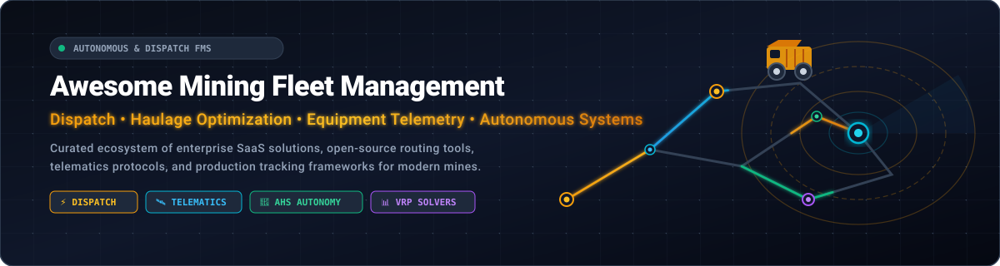
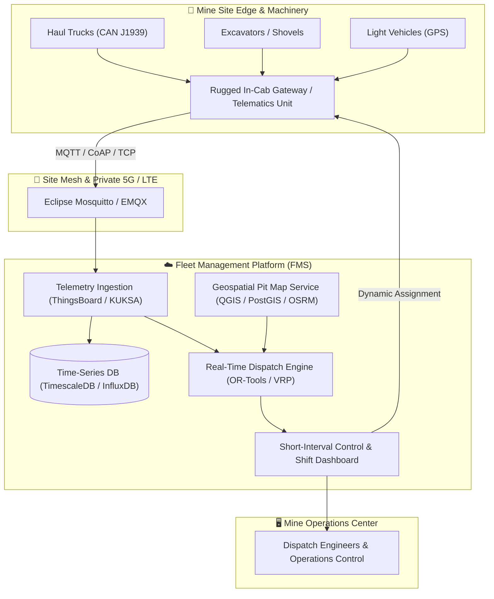

# 🚜 Awesome Mining Fleet Management 🛰️
**A Curated Directory of Enterprise SaaS Platforms & Open-Source Projects for Modern Mining Fleet Management Systems (FMS)**

*Focused on Mine Dispatch, Haulage Cycle Optimization, Heavy Equipment Telemetry, Short-Interval Control & Autonomous Haulage Systems (AHS)*

**📅 Last updated: August 2026**

---

## 📖 Table of Contents
- [📌 Overview & SEO Keywords](#-overview--seo-keywords)
- [🏢 SaaS & Commercial FMS Platforms](#-saas--commercial-fms-platforms)
  - [📊 Market Size & Industry Structure](#-market-size--industry-structure)
  - [📋 SaaS Pricing & Valuation Matrix](#-saas-pricing--valuation-matrix)
- [💻 Open-Source Repositories & Toolkits](#-open-source-repositories--toolkits)
- [🏗️ Architectural Reference for Custom Mining FMS](#️-architectural-reference-for-custom-mining-fms)
- [🤝 How to Contribute](#-how-to-contribute)
- [📈 Star History](#-star-history)
- [⚠️ Disclaimer](#️-disclaimer)

---

## 📌 Overview & SEO Keywords

Mining Fleet Management Systems (**FMS**) coordinate mission-critical operations across open-pit and underground mines. These platforms integrate real-time GPS/GNSS tracking, shovel-truck dynamic allocation, OEM CAN-bus telemetry (J1939/ISOBUS), machine guidance, fatigue management, and autonomous haulage systems (AHS) to maximize tons moved while minimizing cycle times and fuel consumption.

> **Primary Topics & Keywords**: `mining fleet management`, `mine dispatch software`, `haul truck optimization`, `open pit FMS`, `underground fleet tracking`, `Autonomous Haulage System (AHS)`, `Caterpillar MineStar`, `Komatsu Modular DISPATCH`, `Hexagon MineOperate`, `Wenco`, `Micromine Pitram`, `Epiroc Mobilaris`, `Sandvik OptiMine`, `GroundHog`, `telematics J1939`, `short interval control`, `vehicle routing problem (VRP)`.

---

## 🏢 SaaS & Commercial FMS Platforms

### 📊 Market Size & Industry Structure
> **Sector Overview**: The global Mining Fleet Management Systems (FMS) market is estimated at **$5.1 Billion** (growing at a ~9.2% CAGR toward $8.8 Billion by 2030). The sector is **moderately-to-highly concentrated (oligopolistic)** among leading heavy equipment OEMs and industrial technology conglomerates (Caterpillar, Hexagon, Komatsu/Modular, Sandvik, Epiroc, Hitachi/Wenco) with high switching costs and proprietary CAN integrations, alongside specialized, high-growth cloud-native providers (GroundHog, Micromine Pitram, Samsara, Trackunit) dominating modular and mid-tier contractor deployments.

### 📋 SaaS Pricing & Valuation Matrix
*The table below is sorted by **Company Size / Valuation (Descending)**.*

| Platform | Company Size (Market Cap / Valuation / Revenue) | Primary Focus & Capabilities | Starting Pricing | Free Tier / Trial Limits |
| :--- | :--- | :--- | :--- | :--- |
| **[Caterpillar MineStar](https://www.cat.com/en_US/products/new/technology/minestar.html)** | **~$170 Billion Market Cap** (NYSE: CAT, ~$67B Annual Revenue) | Enterprise surface & underground fleet dispatch, health analytics, terrain guidance, and autonomous command (MineStar Edge & Fleet). | Starts at **$3,000/year site base fee + ~$250/asset/month** (MineStar Edge cloud tier). | **180-day free trial** of Health Equipment Insights on new Cat machines; **30–90 day** dealer demo kit pilots. |
| **[Hexagon Mining (HxGN MineOperate)](https://hexagon.com/products/product-groups/mineoperate)** | **~$32 Billion Market Cap** (STO: HEXA-B, ~$5.5B Annual Revenue) | Surface and underground dispatch optimization, machine guidance, payload monitoring, and autonomous fleet coordination. | Starts at **$25,000/site/year** (OP Foundation / entry telematics tier). | **30 to 60-day enterprise Proof-of-Concept (POC)** on selected production equipment with dedicated engineering support. |
| **[Modular Mining (Komatsu DISPATCH)](https://www.modularmining.com/)** | **~$28 Billion Market Cap** (TYO: 6301 Komatsu, ~$25B Annual Revenue) | Industry-standard real-time dynamic truck-shovel assignment, LP haulage optimization, and large-scale open-pit fleet management. | Starts at **$30,000/year** (base modular site license subscription for mid-sized operations). | **30-day guided operational simulation & site POC demo** on active haul profiles. |
| **[Sandvik OptiMine](https://www.rocktechnology.sandvik/en/products/digital-mining-solutions/optimine/)** | **~$25 Billion Market Cap** (STO: SAND, ~$12B Annual Revenue) | Underground mining digital operations suite, 3D spatial machine tracking, schedule compliance, and production analytics. | Starts at **$24,000/year** (modular starter package for underground mobile asset tracking). | **30-day site digital twin simulation pilot** with dedicated application specialist support. |
| **[Epiroc Mobilaris](https://www.epiroc.com/)** | **~$22 Billion Market Cap** (STO: EPI-A, ~$5.5B Annual Revenue) | Underground 3D positioning, situational awareness, traffic control, and mobile equipment telemetry. | Starts at **$20,000/year** (Mobilaris Mining Intelligence entry monitoring package). | **30-day virtual site model pilot / proof of concept** with custom mine layout. |
| **[Samsara](https://www.samsara.com/)** | **~$20 Billion Market Cap** (NYSE: IOT, ~$1.2B Annual Recurring Revenue) | Heavy machinery & mining support fleet telematics, real-time GPS tracking, AI safety cameras, and CAN diagnostics. | Starts at **$27/vehicle/month** (software subscription + ~$99 hardware gateway; 3-year term). | **30-day hardware & software trial** (30-day money-back guarantee / full refund return window). |
| **[Wenco Mine Systems](https://www.wencomine.com/)** | **~$7 Billion Market Cap** (TYO: 6305 Hitachi, ~$9B Annual Revenue) | OEM-agnostic open-pit fleet management, high-precision GPS machine guidance, and production dispatch. | Starts at **$22,000/site/year** (Wenco Lite / production tracking entry baseline). | **30-day on-site pilot demonstration program** with pre-configured mobile tablet hardware. |
| **[Geotab](https://www.geotab.com/)** | **~$3.5 Billion Valuation** (Private, ~$500M+ Annual Recurring Revenue) | Ruggedized heavy-duty vehicle telematics, engine diagnostics, fuel monitoring, and site safety analytics. | Starts at **$30/vehicle/month** (bundled GO hardware + Pro telematics tier). | **30-day free pilot** for up to 20 vehicles (free demo units shipped); **30-day free trial** for Altitude analytics. |
| **[Trackunit](https://www.trackunit.com/)** | **~$1.2 Billion Valuation** (Private / HG Capital, ~$150M+ ARR) | Off-highway machine telematics, heavy equipment health, CAN-bus integration, and utilization monitoring. | Starts at **$15/asset/month** (base Raw/Spot telematics software tier; 36-month agreement). | **30-day free pilot evaluation** on up to 5 machines upon technical consultation. |
| **[Micromine Pitram](https://www.micromine.com/pitram/)** | **~$600 Million Valuation** (Private / Potentia Capital, ~$80M ARR) | Real-time mine control, automated haulage dispatch, short-interval control, and equipment telemetry. | Starts at **$250 AUD/day** (~$5,000 AUD/month modular subscription tier). | **30-day free trial** on select modules (e.g. Alastri with consulting setup); **100% free academic access** via Micromine University Program. |
| **[RPMGlobal](https://rpmglobal.com/)** | **~$450 Million Market Cap** (ASX: RUL, ~$110M Annual Revenue) | Mining asset management, maintenance lifecycle tracking, fleet scheduling, and simulation (AMT / MinePlanner). | Starts at **$18,000/year** (entry AMT asset management subscription). | **30-day guided software trial & personalized sandbox demo** with sample fleet data. |
| **[Fleetio](https://www.fleetio.com/)** | **~$250 Million Valuation** (Private / Series C, ~$40M ARR) | Cloud fleet operations, preventative maintenance schedules, inspections, fuel, and equipment telematics aggregation. | Starts at **$4/vehicle/month** (billed annually, 5-vehicle minimum = **$20/month** starting cost). | **14-day free trial** (no credit card required; full platform access for all registered vehicles). |
| **[ASI Mining](https://www.asirobots.com/)** | **~$120 Million Valuation** (Autonomous Solutions Inc. / Epiroc JV) | OEM-agnostic autonomous haulage systems (AHS), semi-autonomous command, and multi-vehicle dispatch (Mobius). | Starts at **$35,000/year** (Mobius Core baseline coordination software license). | **30-day virtual simulation testbed trial** with digital autonomous haulage scenario evaluation. |
| **[GroundHog](https://groundhogapps.com/)** | **~$35 Million Valuation** (Private / Venture Backed, ~$10M ARR) | Cloud FMS, short-interval control, and production tracking for open-pit and underground mines. | Starts at **$20,000/year** (or ~$1,666/month pay-per-project contractor baseline). | **6-week free on-site pilot program** (no credit card required; full modular access). |

---

## 💻 Open-Source Repositories & Toolkits

*Open-source building blocks for mine dispatch solvers, telematics collectors, geospatial mapping, and vehicle routing. Sorted by **GitHub_Stars (Descending)**.*

| Repository | GitHub_Stars | Focus & Role in Mining Fleet Operations |
| :--- | :--- | :--- |
| **[google/or-tools](https://github.com/google/or-tools)** |  | Google's fast Operations Research suite for Vehicle Routing Problems (VRP), mixed-integer programming, and dynamic truck-shovel dispatch optimization algorithms. |
| **[thingsboard/thingsboard](https://github.com/thingsboard/thingsboard)** |  | Enterprise-grade open-source IoT platform for equipment telemetry ingestion, real-time CAN-bus metrics, geofencing, and mine fleet asset dashboards. |
| **[qgis/QGIS](https://github.com/qgis/QGIS)** |  | Leading open-source Geographic Information System (GIS) used to model mine pit topographies, Digital Terrain Models (DTM), haul roads, and blast patterns. |
| **[traccar/traccar](https://github.com/traccar/traccar)** |  | Modern GPS tracking server supporting 200+ telematics protocols and 2,000+ device models for haul trucks, excavators, and light vehicle tracking. |
| **[eclipse-mosquitto/mosquitto](https://github.com/eclipse-mosquitto/mosquitto)** |  | High-performance, lightweight MQTT broker used in industrial mine IoT networks to ingest real-time machine payload, engine temperature, and speed telematics. |
| **[osrm/osrm-backend](https://github.com/osrm/osrm-backend)** |  | Ultra-fast C++ routing engine for road network distance matrix calculations, haulage cycle time estimations, and shortest-path routing over pit ramps. |
| **[graphhopper/graphhopper](https://github.com/graphhopper/graphhopper)** |  | Fast Java routing engine with integrated Vehicle Routing Problem (VRP) solving, turn-restriction support, and customized haul road profile calculation. |
| **[autowarefoundation/autoware](https://github.com/autowarefoundation/autoware)** |  | Open-source software stack for autonomous driving, localization (NDT/SLAM), perception, and path planning utilized in autonomous vehicle research. |
| **[traccar/traccar-web](https://github.com/traccar/traccar-web)** |  | React-based web interface and live map monitoring application for the Traccar vehicle telemetry platform. |
| **[pgRouting/pgrouting](https://github.com/pgRouting/pgrouting)** |  | Extends PostgreSQL / PostGIS with shortest path (Dijkstra, A*, TSP) graph routing algorithms on custom mine haulage road network vectors. |
| **[openremote/openremote](https://github.com/openremote/openremote)** |  | 100% open-source IoT device management and smart fleet tracking platform with customizable automation rules and map geofences. |
| **[eclipse-kuksa/kuksa.val](https://github.com/eclipse-kuksa/kuksa.val)** |  | In-vehicle telematics server implementing COVESA vehicle data standards (VSS/VISS) for CAN-bus sensor telemetry standardization. |

---

## 🏗️ Architectural Reference for Custom Mining FMS

---

## 🤝 How to Contribute
1. 🍴 Fork the repository.
2. 📝 Add or edit entries in `README.md` (keep descriptions factual, verifiable, and linked to official repositories or vendor pages).
3. 🏷️ When adding SaaS entries, include company size, starting pricing tier, and specific trial limitations.
4. ⭐ When adding open-source projects, include the social star badge linking to the repository's stargazers page.
5. 🚀 Submit a Pull Request with a clear description of your contribution.

---

## 📈 Star History

---

## ⚠️ Disclaimer
- This repository is a **community-curated list** for informational and research purposes only.
- Mining fleet management and equipment dispatch are safety- and production-critical. Uncertified software must never be used for primary autonomous machine control, collision avoidance (CAS), or mission-critical dispatch.
- Always consult official OEM guidelines and certified mining technology safety professionals.

---

<b>Made with ❤️ for mining operations, fleet engineers, and industrial technology teams.</b>

